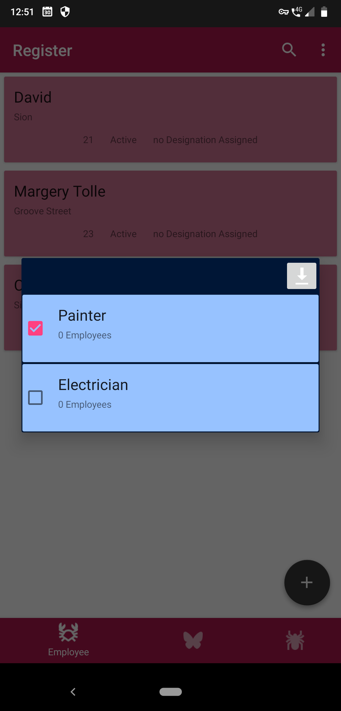
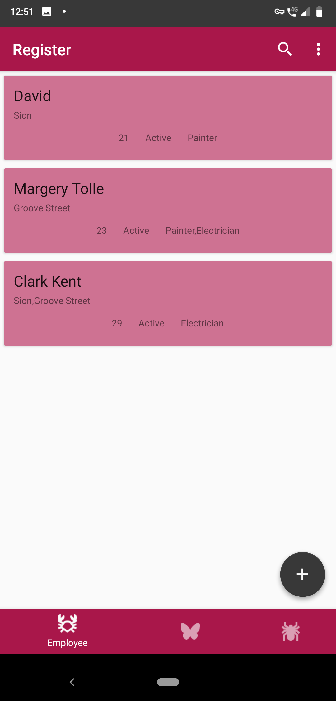
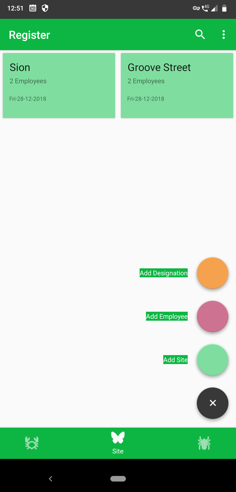
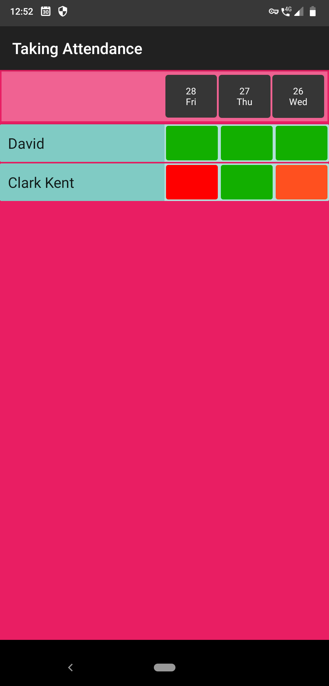
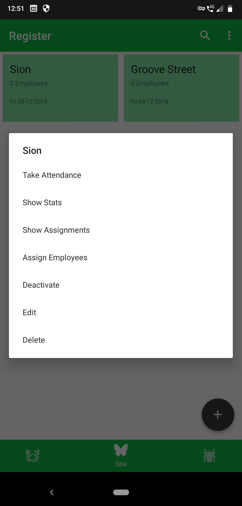
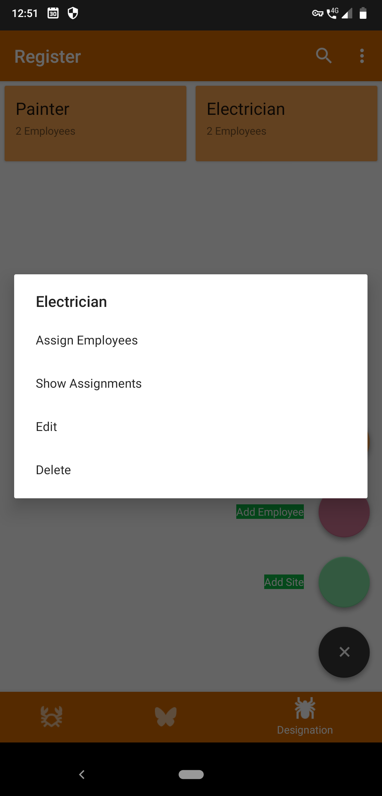
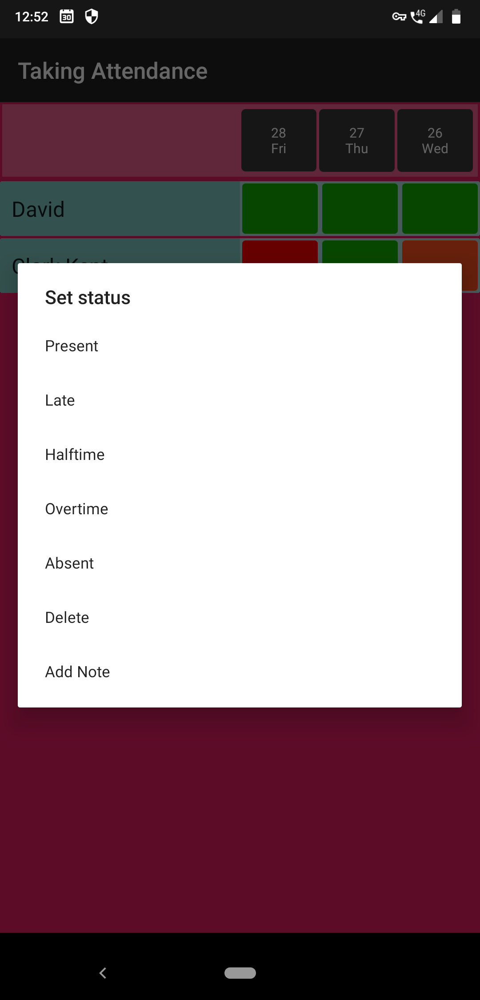
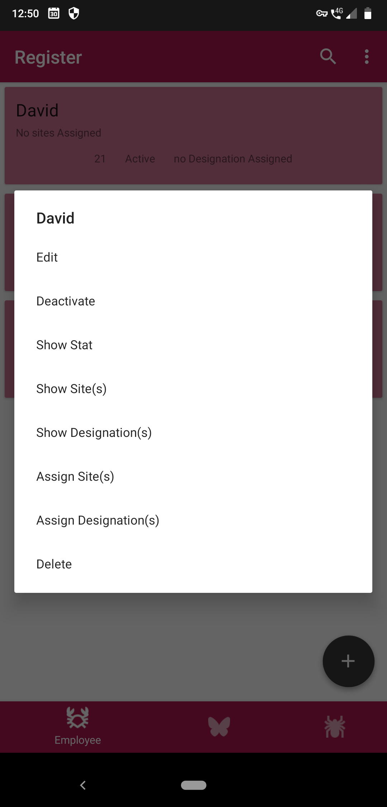
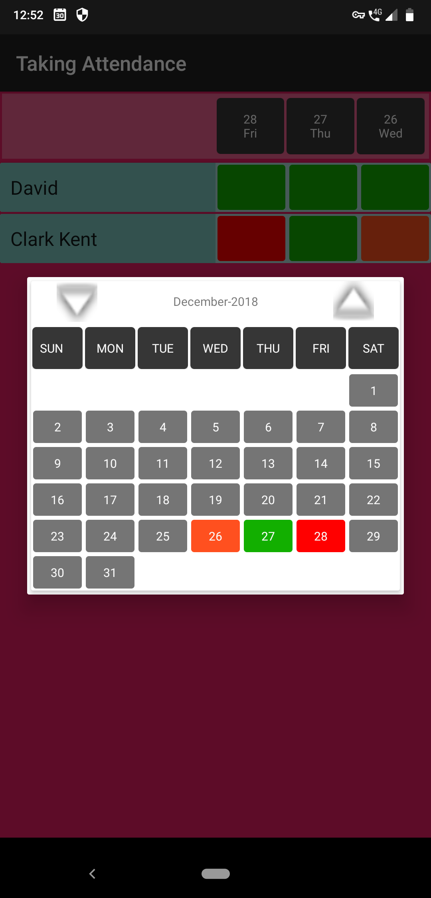

#  MyEmployeeAttendanceRegister : Flexible Register App
To provide clear and concise requirements of an attendance management system for varying members of varying time slots at multiple sites.

## Download
[apk here](https://github.com/sylveryte/MyEmployeeAttendanceRegister/releases/tag/electric_eel)

## Screenshots 

